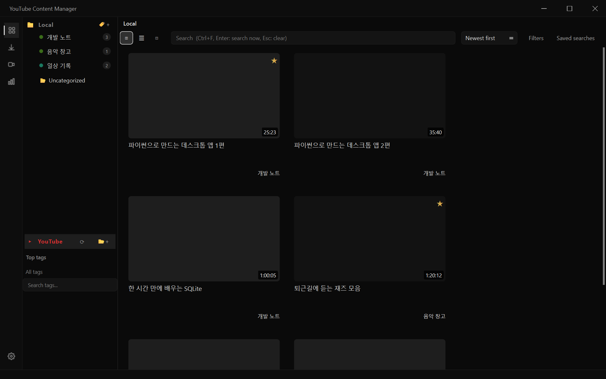
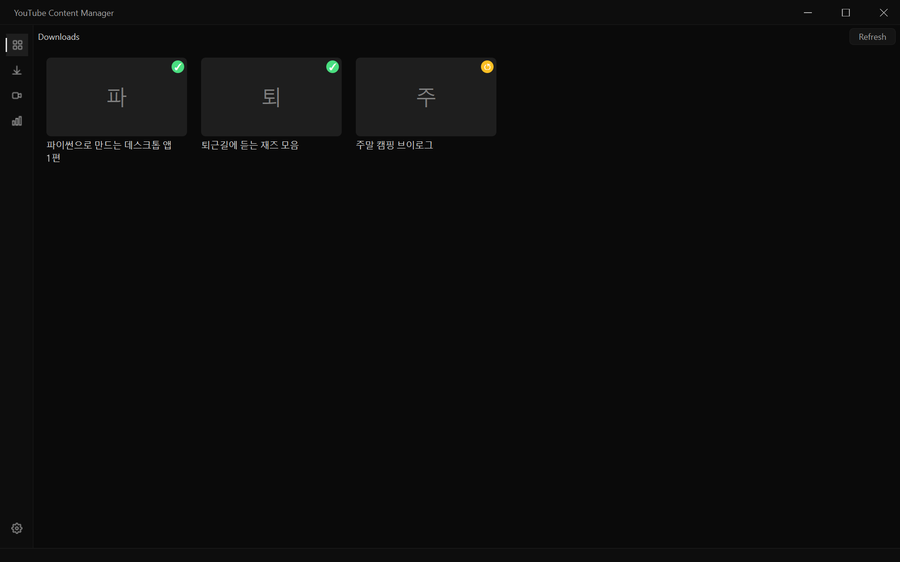
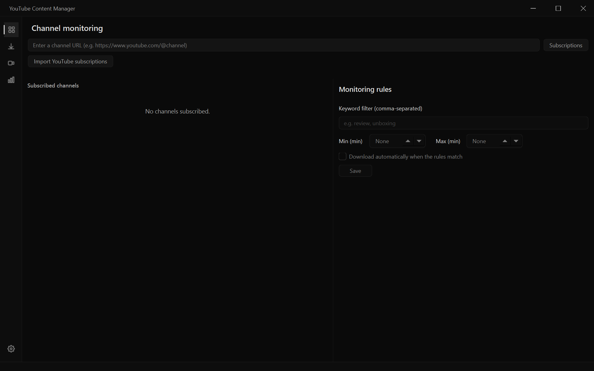
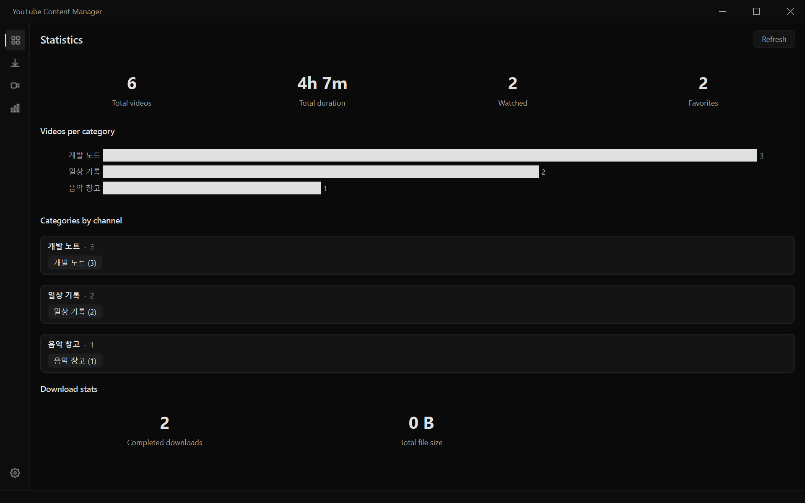
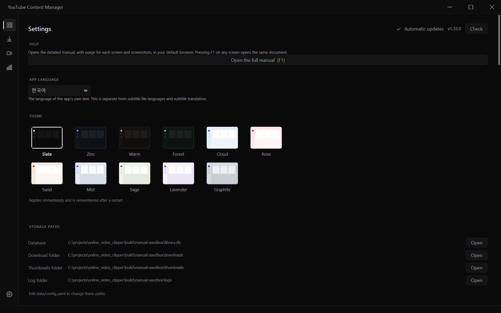

# Full manual

This is the user manual for YouTube Content Manager. It covers, screen by screen, **what you can do and where to click**.

> In the app, press **F1** on any screen, or choose **Settings → Help → Open the full manual**, to open this document.

The screenshots were produced by `scripts/capture_screenshots.py`, which draws the real screens with sample data, so the contents differ from what you see on your own screen.

---

## Table of contents

1. [Getting started](#getting-started)
2. [Library](#library)
3. [Video playback](#video-playback)
4. [Downloads](#downloads)
5. [Channel monitoring](#channel-monitoring)
6. [Statistics](#statistics)
7. [Settings](#settings)
8. [Keyboard shortcuts](#keyboard-shortcuts)
9. [Troubleshooting](#troubleshooting)

---

## Getting started

1. When you launch the app, the **Library** screen opens.
2. When you copy a video address (URL), the app detects it on the clipboard and asks whether to add it. You can turn this off under **Settings → General → Detect URLs on the clipboard**.
3. The title, length and channel of each video you add are filled in automatically.

You can check where your data is stored (database, download folder, logs) under **Settings → Storage paths**, and change it with `data/config.yaml`.

---

## Library

The central screen for collecting, organizing, finding and playing videos.

### Left side — category tree

| Item | Description |
| --- | --- |
| **Local** | Videos you added yourself. Build a hierarchy of categories (folders) beneath it. |
| **Uncategorized** | Videos that have not been given a category yet |
| **YouTube** | Subscriptions and playlists of the account you are signed in with |
| **Top tags / All tags** | Filter instantly by tag |

You can change the order and nesting of categories by **dragging and dropping** them, and you can move videos by dragging them onto a category.

### Top — search and filters

- **Search box**: full-text search across titles, descriptions and notes. `Ctrl+F` jumps to it, `Enter` searches immediately, and `Esc` clears it.
- **View switch**: grid, list or compact. `Ctrl+wheel` also switches the view.
- **Sort**: newest first, by title, by length and more
- **Filters**: combine period, duration, channel, download state and favorites.
- **Saved searches**: save frequently used search and filter combinations under a name.

### Video cards

- **Single click** — detail view (info, notes, subtitles, clips)
- **Double click** — play
- **Right click** — move to a category, edit tags, download, delete and more

The ★ at the top right of a card marks a favorite, and the bottom right shows the duration. Videos you are partway through show a progress strip below the thumbnail.

### Summary (Gemini)

The **Summary** tab of the detail view shows YouTube's Gemini AI summary. Press **⟳** to fetch it again (you must be signed in to YouTube). Double-click to edit it yourself.

- The summary is generated **in the app language** and saved **separately for each language**. Fetching a new one in English leaves your Korean summary untouched.
- If there is no summary in the current language, the app shows one in another language that exists, and a **language chip** (Korean / English) appears at the top of the summary so you can switch between them.
- Your edits are saved to the summary of the **language you are viewing**.

---

## Video playback

Double-click a video to play it right in the app. You do not need to download the file first.

### Quality

Choose it with the quality button on the right of the control bar.

| Choice | Behavior |
| --- | --- |
| **Auto (best quality)** | The default. Plays up to 1080p by **merging the streams on the fly** (nothing is downloaded). |
| 1080p / 720p / 480p | The same method at the quality you pick |
| 360p / 240p | A single stream that needs no merging — starts the fastest |

High-quality video and audio are delivered separately, so they must be merged just before playback. The app **fetches only as much as it needs and streams it through**, so playback starts within a few seconds. If your connection cannot keep the stream going, the app automatically falls back to "download first, then play" (a brief preparing indicator appears).

The quality you choose is kept while you use the app. If your PC struggles, lower it to 720p or below.

### Subtitles

- Choose a subtitle track with the **CC** button on the control bar. You can turn on **two lines at once**, the original language and your native language.
- For videos without subtitles, you can generate them with speech recognition (**Settings → Subtitles**).
- If the sync is off, nudge it by 0.25 seconds with `[` and `]`.

### Other

- **Skip segments (SponsorBlock)**: automatically skips ads and sponsored segments (turn it on or off in Settings).
- **Clip extraction**: mark a start and an end in the detail view to save just that range as a file.
- **PiP / full screen**: the buttons on the control bar, or `F`

---

## Downloads

- You can download a single video, a playlist or a whole channel.
- Choose the quality (2160p to 360p) and format (mp4, mkv, webm, mp3, m4a).
- Set the **number of concurrent downloads** from 1 to 8 in Settings.
- Failed downloads are retried automatically, and the history is kept.
- You can choose separately whether to download subtitles, thumbnails and metadata along with the video.

Jobs in progress also appear in the strip at the bottom of the window, so you can see their status from any other screen.

---

## Channel monitoring

Register a channel address and the app periodically checks whether new videos have been posted.

- Set the check interval under **Settings → Notifications**.
- You can attach an **automatic download rule** (title keyword, minimum and maximum duration) to each channel.
- When a new video is detected, you are notified with a system tray notification.

---

## Statistics

- Video count and total duration by category and channel
- Trend of additions over time
- Click a channel entry to jump straight to its category.

---

## Settings

**Help** is at the top, followed by the other items.

| Item | Contents |
| --- | --- |
| **Help** | Opens this manual in your default browser (= `F1`) |
| **App language** | The display language (Korean / English). It takes effect **after a restart**, and any text that has not been translated stays in Korean. It is separate from the subtitle language setting. |
| **Theme** | 11 presets. A preset applies immediately when you click it and is kept after you restart. |
| **Storage paths** | View and open the locations of the database, downloads, thumbnails and logs |
| **General** | Concurrent downloads, concurrent node loads, clipboard detection, automatic enrichment |
| **Notifications** | Staying in the tray, channel check interval |
| **Downloads** | Default folder, quality and format, filename rules, embedding metadata |
| **Lyrics sources / Cloud sync / Transfer** | Lyrics providers, OneDrive and Google Drive integration |
| **Watch folder / Import from bookmarks** | Automatic folder registration, bulk import of browser bookmarks |
| **Library cleanup** | Find duplicate videos and missing files (you choose what to delete) |
| **Subtitle index / YouTube API / Cookies / Hidden tags** | Advanced settings |

---

## Keyboard shortcuts

### Everywhere

| Key | Action |
| --- | --- |
| `F1` | Open this manual |
| `Ctrl+F` | Jump to the search box |
| `Esc` | Clear the search / go back |
| `F5` | Refresh |
| Mouse ‹ › | Back / forward |

### During playback

| Key | Action |
| --- | --- |
| `Space`, `K` | Play / pause |
| `J`, `L` | Back / forward 10 seconds |
| `←`, `→` | Back / forward 5 seconds |
| `↑`, `↓` | Volume up / down |
| `0`~`9` | Jump to that percentage of the video |
| `M` | Mute |
| `F` | Full screen |
| `P` | PiP |
| `C` | Subtitles on/off |
| `[`, `]` | Subtitle sync -0.25 s / +0.25 s |
| `\` | Reset subtitle sync |
| `Ctrl` + wheel | Subtitle size |
| `Ctrl+Shift` + wheel | Subtitle position |

### Reading screens

| Key | Action |
| --- | --- |
| `Ctrl` `+` / `-` | Larger / smaller text |
| `Ctrl+0` | Reset text size |

---

## Troubleshooting

**Playback is only at low quality**
Check that the quality on the control bar is not fixed at 360p. The default is "Auto (best quality)".

**Playback stutters at high quality**
Sometimes the video provider limits how far ahead the app can read. The app automatically falls back to "download first, then play", but if your connection is slow, choosing 720p or below is more stable.

**A video will not play at all**
The reason is shown where the video should be. Use the 🌐 button at the top right to open it in your browser and check that the original still exists. It may be region-restricted or deleted.

**Downloads keep failing**
Connect your browser cookies under **Settings → Cookies** to download videos that require you to be signed in.

**I want to see the log**
**Settings → Storage paths → Log folder → Open**. When you report a problem, please send `app.log` along with it so the cause is easier to find.
