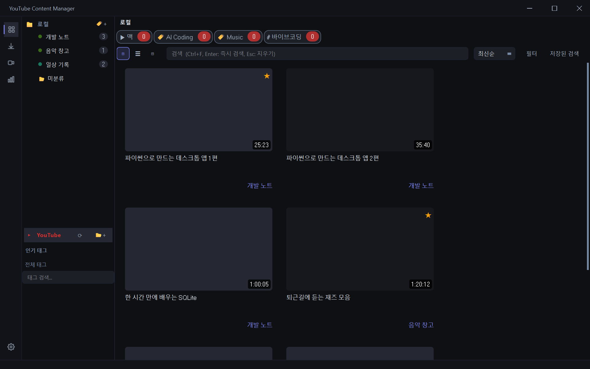
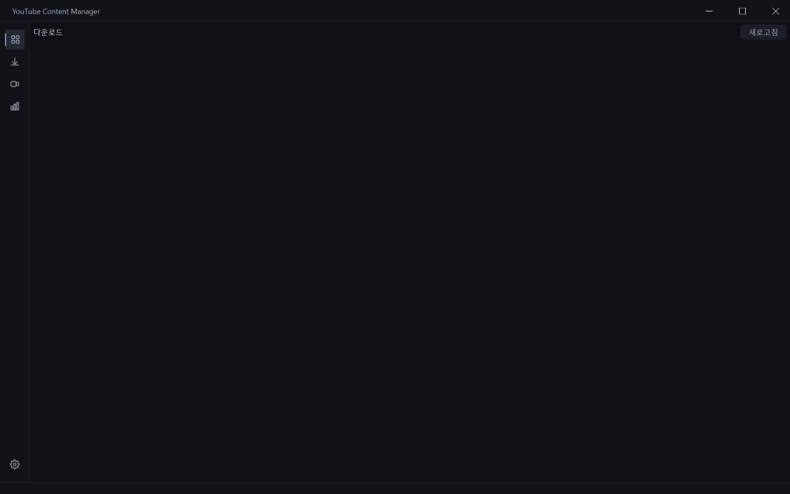
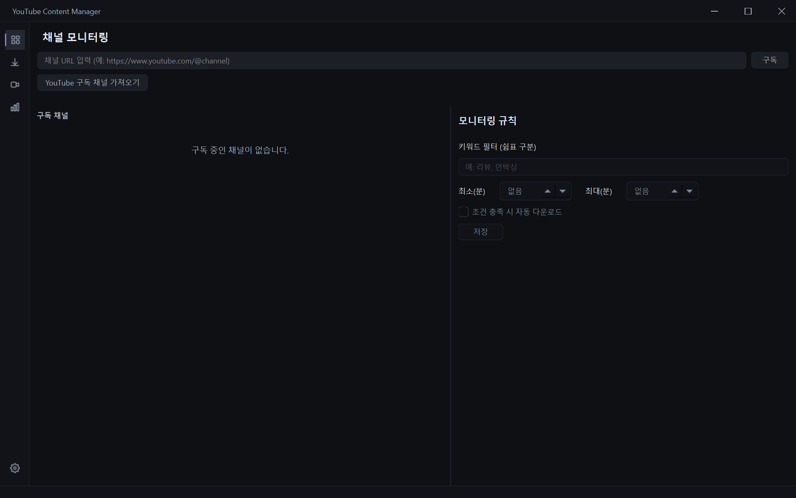
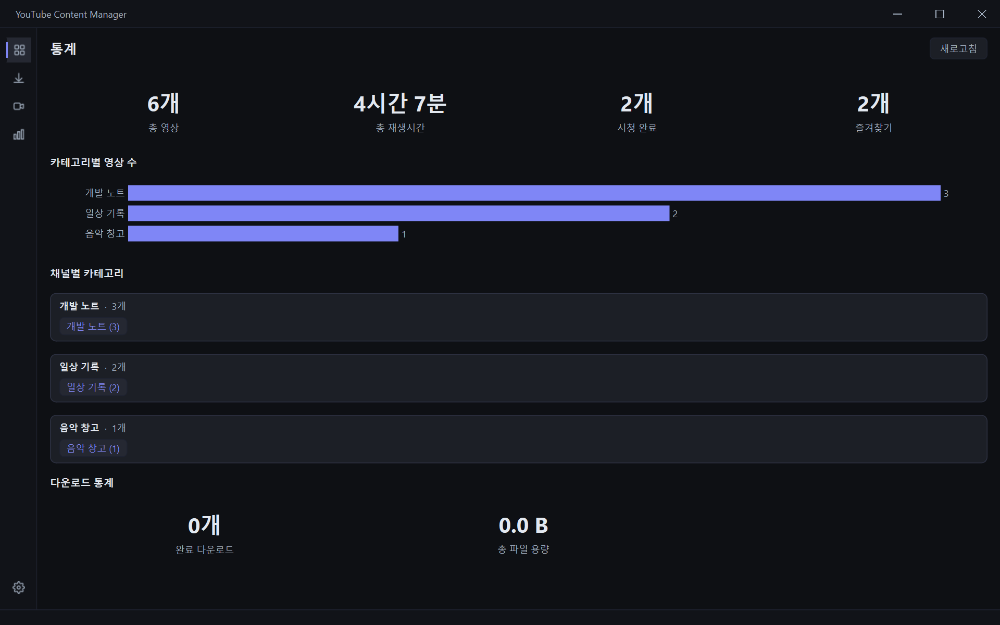
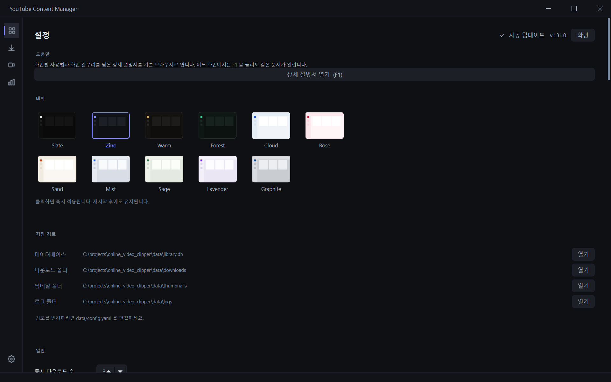

# 상세 설명서

YouTube Content Manager 사용 설명서입니다. 화면별로 **무엇을 할 수 있고, 어디를 누르면 되는지**를 담았습니다.

> 앱 안에서는 아무 화면에서나 **F1** 을 누르거나, **설정 → 도움말 → 상세 설명서 열기** 로 이 문서를 열 수 있습니다.

갈무리는 `scripts/capture_screenshots.py` 가 표본 자료로 실제 화면을 그려 만든 것이라, 여러분 화면의 자료와는 다릅니다.

---

## 목차

1. [처음 시작하기](#처음-시작하기)
2. [라이브러리](#라이브러리)
3. [영상 재생](#영상-재생)
4. [다운로드](#다운로드)
5. [채널 모니터링](#채널-모니터링)
6. [통계](#통계)
7. [설정](#설정)
8. [단축키 모음](#단축키-모음)
9. [문제가 생겼을 때](#문제가-생겼을-때)

---

## 처음 시작하기

1. 앱을 실행하면 **라이브러리** 화면이 열립니다.
2. 영상 주소(URL)를 복사하면 클립보드를 감지해 추가 여부를 물어봅니다. 이 동작은 **설정 → 일반 → 클립보드 감지** 에서 끌 수 있습니다.
3. 추가한 영상은 제목·길이·채널 정보를 자동으로 채웁니다.

저장 위치(데이터베이스·다운로드 폴더·로그)는 **설정 → 저장 경로** 에서 확인할 수 있고, `data/config.yaml` 로 바꿉니다.

---

## 라이브러리

영상을 모으고, 분류하고, 찾고, 재생하는 중심 화면입니다.

### 왼쪽 — 분류 트리

| 항목 | 설명 |
| --- | --- |
| **로컬** | 내가 직접 추가한 영상. 하위에 카테고리(폴더)를 계층으로 만듭니다. |
| **미분류** | 카테고리를 아직 정하지 않은 영상 |
| **YouTube** | 로그인한 계정의 구독·재생목록 |
| **인기 태그 / 전체 태그** | 태그로 바로 걸러 보기 |

카테고리는 **끌어다 놓기**로 순서와 소속을 바꿀 수 있고, 영상도 카테고리 위로 끌어다 옮깁니다.

### 위쪽 — 검색과 필터

- **검색창**: 제목·설명·메모를 전문 검색합니다. `Ctrl+F` 로 바로 이동, `Enter` 로 즉시 검색, `Esc` 로 지웁니다.
- **보기 전환**: 격자 / 목록 / 간략 세 가지. `Ctrl+휠` 로도 바뀝니다.
- **정렬**: 최신순·제목순·길이순 등
- **필터**: 기간, 재생시간, 채널, 다운로드 여부, 즐겨찾기를 겹쳐서 적용합니다.
- **저장된 검색**: 자주 쓰는 검색·필터 조합을 이름 붙여 저장합니다.

### 영상 카드

- **한 번 클릭** — 상세 화면(정보·메모·자막·클립)
- **더블 클릭** — 재생
- **오른쪽 클릭** — 카테고리 이동, 태그 편집, 다운로드, 삭제 등

카드 오른쪽 위 ★ 는 즐겨찾기, 오른쪽 아래는 재생시간입니다. 이어보기 중인 영상은 썸네일 아래에 진행률 띠가 표시됩니다.

---

## 영상 재생

영상을 더블 클릭하면 앱 안에서 바로 재생됩니다. 파일을 미리 내려받지 않아도 됩니다.

### 화질

컨트롤바 오른쪽의 화질 단추로 고릅니다.

| 선택 | 동작 |
| --- | --- |
| **자동 (최고 화질)** | 기본값. 1080p까지 **실시간으로 합쳐 가며** 재생합니다(내려받지 않습니다). |
| 1080p / 720p / 480p | 지정한 화질로 같은 방식 |
| 360p / 240p | 합칠 필요가 없는 단일 스트림 — 가장 빨리 시작합니다 |

고화질은 영상과 소리가 따로 제공되기 때문에 재생 직전에 합쳐야 합니다. 이 앱은 **필요한 만큼만 받아 흘려보내므로** 몇 초 안에 재생이 시작됩니다. 회선 사정으로 스트림이 버티지 못하면 자동으로 "받아 두고 재생"하는 방식으로 내려갑니다(잠시 준비 표시가 뜹니다).

선택한 화질은 앱을 쓰는 동안 유지됩니다. 저사양 PC에서 버겁다면 720p 이하로 낮추세요.

### 자막

- 컨트롤바의 **CC** 단추로 자막 트랙을 고릅니다. 원어와 모국어 **두 줄을 동시에** 켤 수 있습니다.
- 자막이 없는 영상은 음성 인식으로 만들 수 있습니다(**설정 → 자막**).
- 싱크가 맞지 않으면 `[` `]` 로 0.25초씩 밀고 당깁니다.

### 기타

- **구간 건너뛰기(SponsorBlock)**: 광고·후원 구간을 자동으로 넘깁니다(설정에서 켜고 끕니다).
- **클립 추출**: 상세 화면에서 시작·끝을 찍어 그 구간만 파일로 저장합니다.
- **PiP / 전체화면**: 컨트롤바의 단추 또는 `F`

---

## 다운로드

- 단일 영상, 재생목록, 채널 전체를 받을 수 있습니다.
- 화질(2160p~360p)과 형식(mp4·mkv·webm·mp3·m4a)을 고릅니다.
- **동시 다운로드 수**는 설정에서 1~8개로 조절합니다.
- 실패하면 자동으로 다시 시도하고, 이력은 남습니다.
- 자막·썸네일·메타데이터를 함께 받을지 따로 고를 수 있습니다.

진행 중인 작업은 화면 아래 띠에도 표시되어, 다른 화면에 있어도 상태를 볼 수 있습니다.

---

## 채널 모니터링

채널 주소를 등록하면 새 영상이 올라왔는지 주기적으로 확인합니다.

- 확인 주기는 **설정 → 알림** 에서 정합니다.
- 채널별로 **자동 다운로드 규칙**(제목 키워드, 최소/최대 재생시간)을 걸 수 있습니다.
- 새 영상이 감지되면 시스템 트레이 알림으로 알려 줍니다.

---

## 통계

- 카테고리·채널별 영상 수와 총 재생시간
- 기간별 추가 추이
- 채널 항목을 누르면 해당 카테고리로 바로 이동합니다.

---

## 설정

맨 위가 **도움말** 이고, 그 아래로 항목이 이어집니다.

| 항목 | 내용 |
| --- | --- |
| **도움말** | 이 설명서를 기본 브라우저로 엽니다(= `F1`) |
| **테마** | 11가지 프리셋. 누르면 즉시 적용되고 다시 켜도 유지됩니다. |
| **저장 경로** | 데이터베이스·다운로드·썸네일·로그 위치 확인 및 열기 |
| **일반** | 동시 다운로드 수, 노드 동시 로딩 수, 클립보드 감지, 자동 보강 |
| **알림** | 트레이 상주, 채널 확인 주기 |
| **다운로드** | 기본 폴더·화질·형식, 파일명 규칙, 메타데이터 굽기 |
| **가사 출처 / 클라우드 동기화 / 전송** | 가사 제공처, OneDrive·Google Drive 연동 |
| **감시 폴더 / 북마크 가져오기** | 폴더 자동 등록, 브라우저 북마크 일괄 임포트 |
| **라이브러리 정리** | 중복 영상·사라진 파일 찾기(지우는 것은 직접 고릅니다) |
| **자막 색인 / YouTube API / 쿠키 / 숨김 태그** | 고급 설정 |

---

## 단축키 모음

### 어디서나

| 키 | 동작 |
| --- | --- |
| `F1` | 이 설명서 열기 |
| `Ctrl+F` | 검색창으로 이동 |
| `Esc` | 검색 지우기 / 뒤로 |
| `F5` | 새로 고침 |
| 마우스 ‹ › | 뒤로 / 앞으로 |

### 재생 중

| 키 | 동작 |
| --- | --- |
| `Space`, `K` | 재생 / 일시정지 |
| `J`, `L` | 10초 뒤로 / 앞으로 |
| `←`, `→` | 5초 뒤로 / 앞으로 |
| `↑`, `↓` | 소리 크게 / 작게 |
| `0`~`9` | 해당 백분율 지점으로 이동 |
| `M` | 음소거 |
| `F` | 전체화면 |
| `P` | PiP |
| `C` | 자막 켜기/끄기 |
| `[`, `]` | 자막 싱크 -0.25초 / +0.25초 |
| `\` | 자막 싱크 초기화 |
| `Ctrl` + 휠 | 자막 크기 |
| `Ctrl+Shift` + 휠 | 자막 위치 |

### 읽는 화면

| 키 | 동작 |
| --- | --- |
| `Ctrl` `+` / `-` | 글자 크게 / 작게 |
| `Ctrl+0` | 글자 크기 원래대로 |

---

## 문제가 생겼을 때

**재생이 낮은 화질로만 됩니다**
컨트롤바의 화질이 360p로 고정돼 있지 않은지 확인하세요. 기본값은 "자동 (최고 화질)" 입니다.

**고화질에서 재생이 끊깁니다**
영상 제공처가 앞서 읽는 것을 제한하는 경우가 있습니다. 앱이 자동으로 "받아 두고 재생"으로 내려가지만, 회선이 느리다면 720p 이하를 고르는 편이 안정적입니다.

**재생이 아예 되지 않습니다**
영상 자리에 이유가 표시됩니다. 오른쪽 위 🌐 단추로 브라우저에서 열어 원본이 살아 있는지 확인해 보세요. 지역 제한·삭제된 영상일 수 있습니다.

**다운로드가 계속 실패합니다**
**설정 → 쿠키** 에서 브라우저 쿠키를 연결하면 로그인이 필요한 영상도 받을 수 있습니다.

**로그를 보고 싶습니다**
**설정 → 저장 경로 → 로그 폴더 → 열기**. 문제를 신고할 때 `app.log` 를 함께 보내 주시면 원인을 찾기 쉽습니다.
